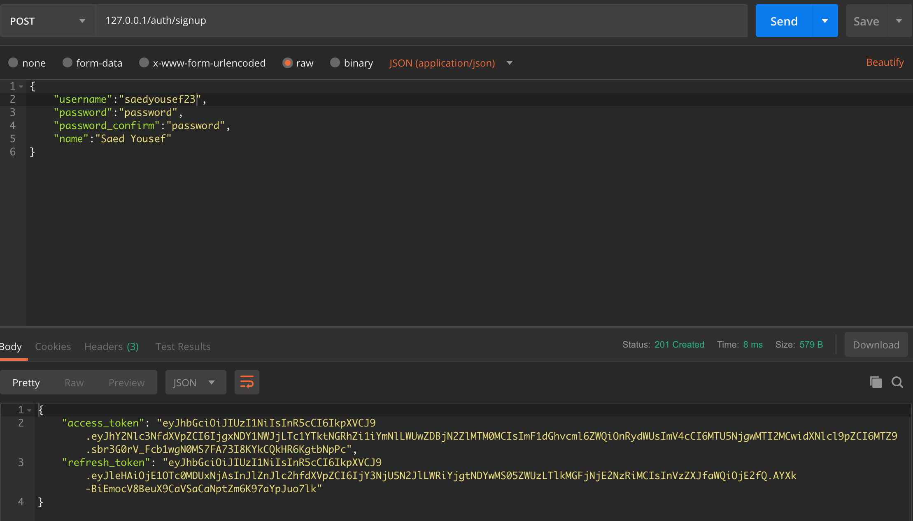
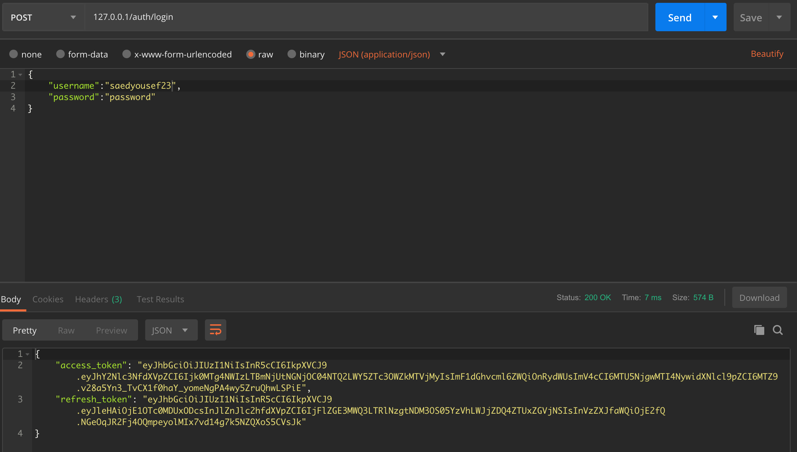
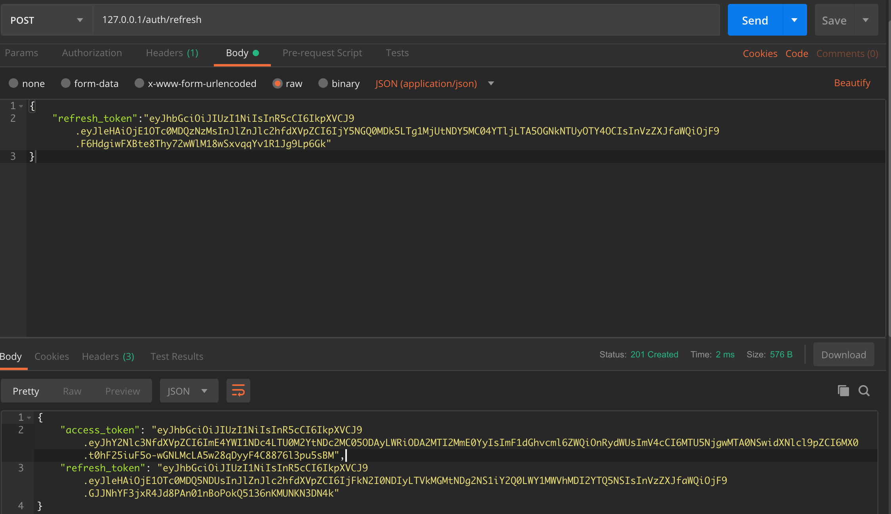

# Abwaab Task

## Installation


```
$ cd /to/your/go/src/ON_YOUR_MACHINE & git clone https://github.com/saedyousef/abwaab-task.git

```

---

Now lets copy our .env.example into .env.
The .env file contains our secret keys and Twitter App's keys.
```

$ cd abwaab-task & cp .env.example /path/to/project/.env

```

> We will start our app now

`$ go run main.go`

You will notice that go modules are installing.

Now we're ready to go!

---


Let's Browse the APIs

## APIs

> Auth APIs

Singup API, this api accept POST method, and Content-type : application/json
request body: 
```
{
    "username": "anyusername",
    "password": "PASSWORD",
    "password_confirm": "PASSWORD",
    "name": "Saed Yousef" 
}

```
Check sample request and response from postman in the screenshot.


---

Login API, this api accept POST method, and Content-type : application/json
request body: 
```
{
    "username": "YOUR_USERNAME",
    "password": "YOUR_PASSWORD"
}

```
Check sample request and response from postman in the screenshot.


---

Refresh Token API, this api accept POST method, and Content-type : application/json
request body: 
```
{
    "refresh_token": "YOUR_REFRESH_TOKEN"
}

```
Afte your access token is expired you can request this api to refresh your access token by provides your refresh_token
Check sample request and response from postman in the screenshot.


---
### How To authorize request?

To authorize a request, in postman Click on Authorization and select Bearer Token and place your access_token that is returned from login, signup or refresh apis.

---

> Twitter Search API

Twitter Search API, this api accept GET method, and requires a string query param "query" and return the first 50 matched results.

Authentication required to make a request on this API.

Check sample request and response from postman in the screenshot.


